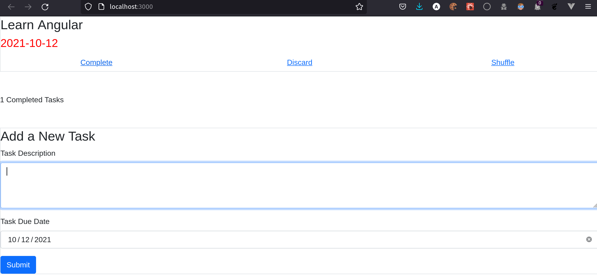
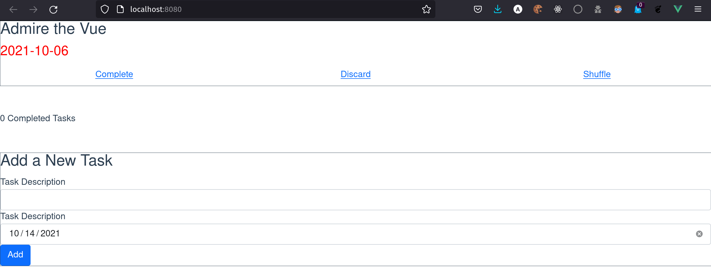

## Task Pop

Task managing application implemented in React & Vue. This tool helps you keep track of your pending tasks by only presenting one task in your backlog at a time. You can complete tasks when they're done, discard if no longer relevant, and shuffle to pick a different task. You can also keep track of the number of tasks completed.

Used bootstrap react and vue components. Planning to make an angular task pop app in the near future.

## Individual Implementations:

### Task Pop React

Run the react dev server by cd'ing into taskpopreact and running `npm start`

### Task Pop Vue

Run the vue dev server by cd'ing into taskpopreact and running `npm serve`

### Task Pop Angular

Coming soon!